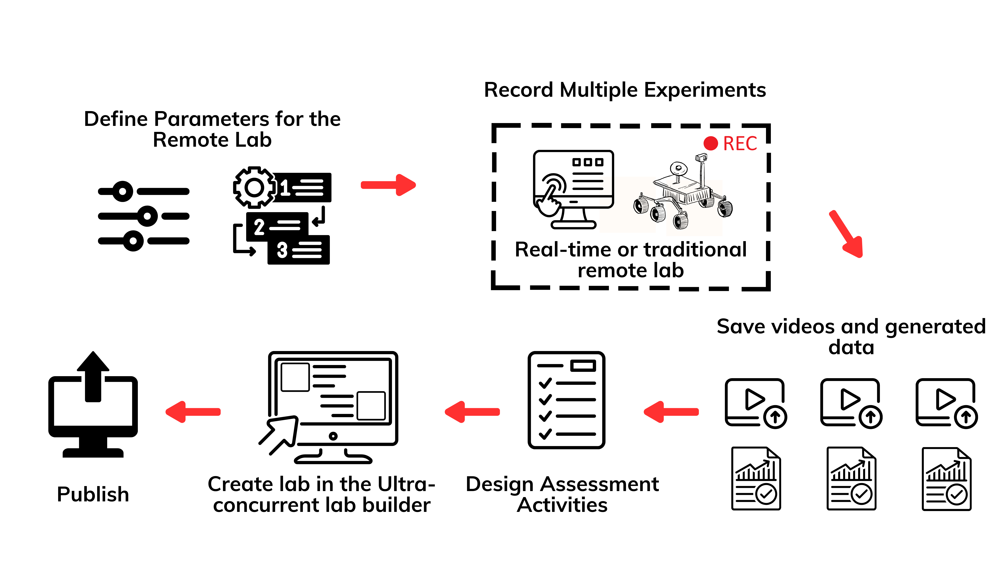
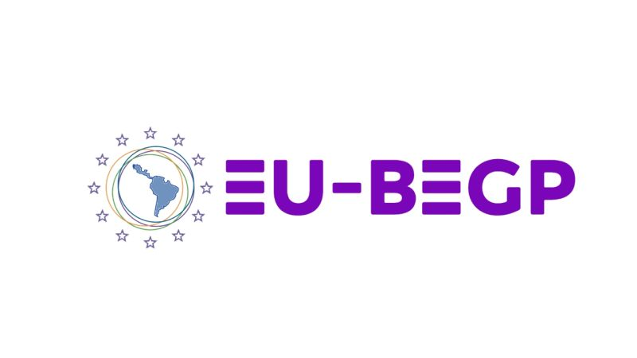

# UltraConcurrent Remote Labs Builder

The UltraConcurrent Remote Labs Builder presents a web-based platform that enables the transformation of real-time remote labs into ultra-concurrent remote labs.

The platform allows educators to create scalable remote laboratory experiences using pre-recorded experiments, dynamic parameter selection, and interactive assessment activities, removing the need for exclusive time-slot access.

## Getting Started

The installation of the UltraConcurrent Remote Labds Builder is simplified using Docker technology.

## Usage

### Prerequisites

Before getting started, ensure you need to have [Docker](https://www.docker.com/) and [Docker Compose](https://docs.docker.com/compose/) installed on your system.

### Components

The project consists of two main components:

- **RESTful API:** Built using [Django](https://www.djangoproject.com/).
- **User Interface (UI):** Built using [Angular](https://angular.io/).

### Deployment

The project's containerized architecture ensures easy deployment in a production environment.

You can utilize any container orchestration tool, such as Kubernetes or Docker Swarm, to deploy the services.

Additionally, for efficient handling of HTTP traffic, consider incorporating Nginx into your deployment setup to enhance performance and scalability.

## Authors

- Andres Gamboa (Universidad Privada Boliviana - UPB)
- Boris Pedraza (Universidad Privada Boliviana - UPB)
- Alex Villazon (Universidad Privada Boliviana - UPB)
- Omar Ormachea (Universidad Privada Boliviana - UPB)

## Publications

- Andrés Gamboa, Boris Pedraza, Alex Villazón, and Omar Ormachea.
  Turning Real-Time Remote Labs into Ultra-Concurrent Remote Labs. STE2025 Conference.

## Acknowledgments

This work was partially funded by the Erasmus+ Project “EU-BEGP” (No. 101081473).

## License

This project is licensed under the MIT License - see the LICENSE file for details.

## More Information

For more information about the project, please visit our [website](https://eu-begp.org/).
